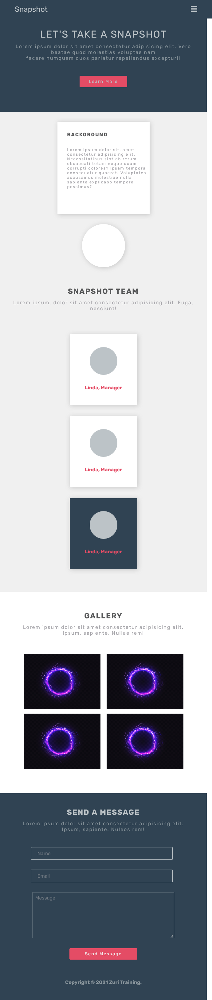

# Responsive Web Design

This is a solution to the Responsive Web Design task under Zuri Training's Front end Track

## Table of contents

- [Overview](#overview)
  - [The challenge](#the-challenge)
  - [Screenshot](#screenshot)
- [My process](#my-process)
  - [Built with](#built-with)
  - [What I learned](#what-i-learned)
  - [Continued development](#continued-development)
  - [Useful resources](#useful-resources)
- [Author](#author)
- [Acknowledgments](#acknowledgments)

## Overview

### The challenge

Users should be able to:

- make a page responsive using media query.
- use JavaScript to make the navigation bar functional.
- do Not Use Any Framework. Just HTML, CSS, and JavaScript.

### Screenshot

## My process

Looking at the CSS and HTML I was provided, the best and easiest way to make this responsive was desktop instead of my preferred mobile first approach. I then reimagined the desktop flow on a mobile and used media queries to make the page responsive.

### Built with

- HTML5 markup
- CSS custom properties
- JavaScript
- Flex

### What I learned

- Position can be replaced using flex.

### Continued development

I will be focusing on completing all Zuri Training challenges

### Useful resources

- [Course](https://courses.kevinpowell.co/courses/conquering-responsive-layouts/) - This is a great course for anyone who wants to improve their responsive design skills.
- [Video](https://www.youtube.com/watch?v=YET_K1w0PJo) - CSS Media Query

## Author

- Twitter - [@justinjoe6](https://www.twitter.com/justinjoe6)

## Acknowledgments

Thanks to Zuri Training for the free training and challenge.
