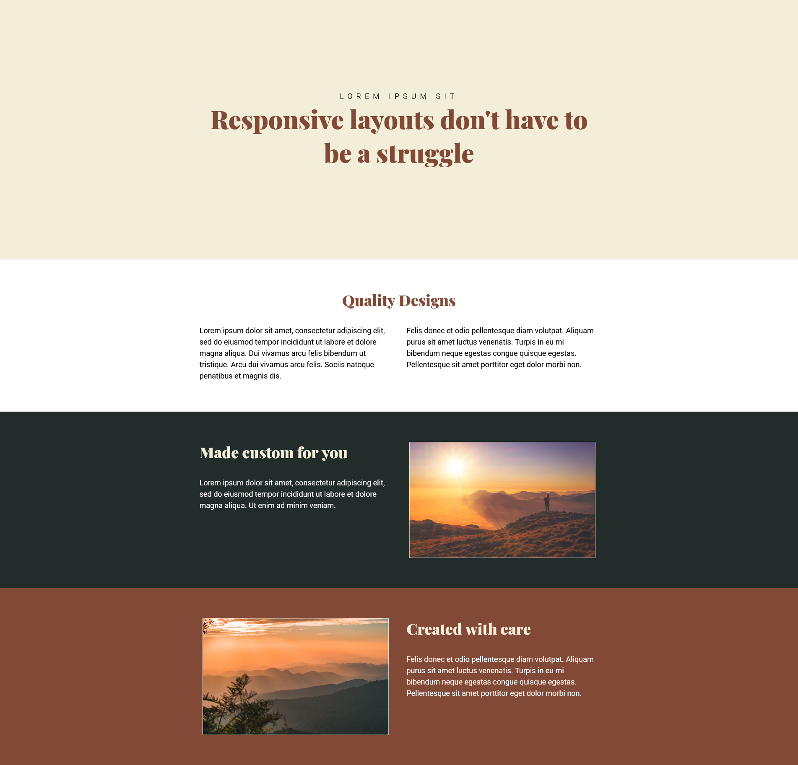

# Conquering Responsive Design by Kevin Powell Flexbox Challenge

This is a solution to the Conquering Responsive layout course by Kevin Powell. 

## Table of contents

- [Overview](#overview)
  - [The challenge](#the-challenge)
  - [Screenshot](#screenshot)
- [My process](#my-process)
  - [Built with](#built-with)
  - [What I learned](#what-i-learned)
  - [Continued development](#continued-development)
  - [Useful resources](#useful-resources)
- [Author](#author)
- [Acknowledgments](#acknowledgments)

## Overview

### The challenge

Users should be able to:

- code a responsive page using flex box

### Screenshot

 

## My process
After 

### Built with

- Semantic HTML5 markup
- CSS custom properties
- Flex
- Mobile-first workflow

### What I learned

- Some useful VSCode shortcuts using Emmet

- Writing CSS hinging on the relationship between a parent and child
    The first selector targets the children of a split class while the second targets children next to each other
    ```css
    .split > * {
        flex-basis: 100%;
    }
    
    .split > * + * {
        margin-left: 2em
    }
    ```
    
    min() helps build a responsive website by keeping a minimum of 90% of the screen filled and max of 70.5em filled depending on the width.
    Margin left AND right shortcut
    ```css
    div {
        width: min(90%, 70.5em);
        margin-inline: auto;
    }
    
    ```

### Continued development

I will be focusing on building more responsive pages/websites to strengthen my understanding from the tutorial and my CSS skills by implementing what I've learned in my projects I work on and other challenges such as FrontendMentor.

### Useful resources

- [Course](https://courses.kevinpowell.co/courses/conquering-responsive-layouts/) - This is a great course for anyone who wants to improve their responsive design skills.


## Author

- Twitter - [@justinjoe6](https://www.twitter.com/justinjoe6)

## Acknowledgments

Thanks to Kevin Powell for sharing such an amazing tutorial for free.